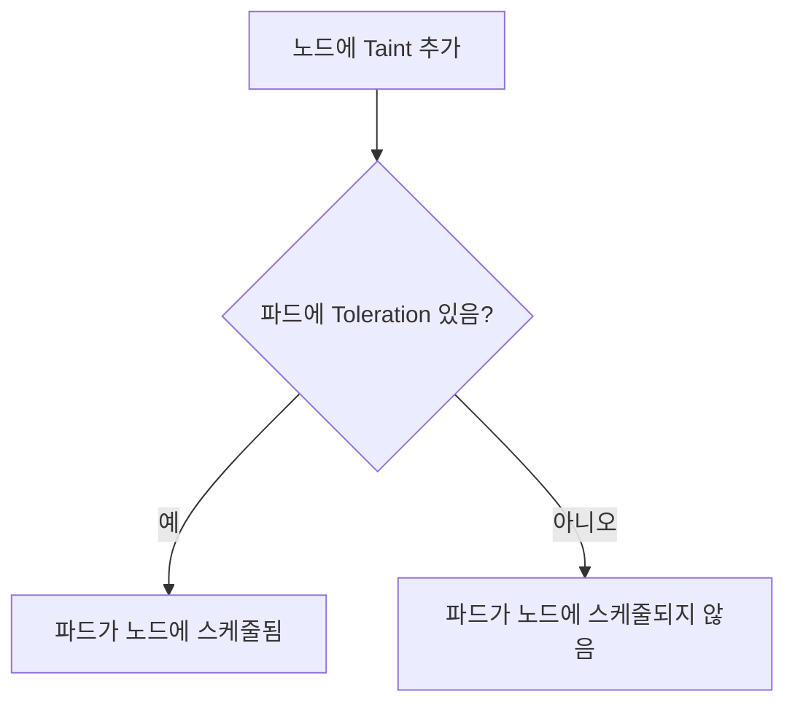

# 개요

쿠버네티스에는 특이한 개념이 있는데, 바로 Taint와 Toleration이라는 속성이 있다.  
영어로 직역하자면 Taint는 오염, 더러움 등을 뜻하고 Toleration은 관용, 인내라는 의미인데, 왜 이런 표현을 쿠버네티스에서 사용하고, 어떤 상황에서 쓰일 수 있는지 한번 확인해 볼 필요가 있다.

# Why Taint & Toleration

쿠버네티스에서 특정 노드에 파드를 배치하는 전략은 다양하다.  
가장 대표적으로 NodeSelector를 사용할 수 있고, 이외에도 Affinity를 사용할 수 있다.

애플리케이션을 배포하는 관점에서 특정 노드를 선택해서 배포하고 싶을 경우, NodeSelector나 Affinity를 사용하면 스케줄러가 Node를 평가하는 단계에서 Node Label로 필터링을 하고, 이후 스코어링을 통해 적절한 노드를 선택하게 된다.

이런 방식으로 Affinity를 사용하여 파드가 노드를 선택할 수 있지만,  
Taint와 Toleration은 반대로 노드가 파드를 거부(제외)할 수 있는 방식으로 동작한다.

즉,  
- Affinity/NodeSelector: 파드가 "이 노드에 가고 싶다"  
- Taint/Toleration: 노드가 "이 파드는 오지 마라" (단, Toleration이 있으면 예외적으로 허용)

# 언제 사용할 수 있는 걸까?

- 전용 노드: 예를 들어, 특정 워크로드(예: GPU 작업)만 실행해야 하는 노드에 다른 파드가 스케줄되지 않도록 하고 싶을 때
- 노드 장애 대응: 노드에 문제가 생겼을 때, 해당 노드에 있던 파드를 자동으로 축출(eviction)하고 싶을 때
- 특정 리소스 압박: 메모리, 디스크, PID 등 리소스 압박이 발생한 노드에 파드가 스케줄되지 않도록 할 때

# Taint와 Toleration의 동작 방식

- Taint: 노드에 설정하는 속성. 해당 Taint가 있는 노드에는, 이를 Toleration하지 않는 파드는 스케줄될 수 없다.
- Toleration: 파드에 설정하는 속성. 특정 Taint를 "인내"할 수 있음을 명시한다.



# 실전 예시

## 1. GPU 전용 노드 만들기

예를 들어, GPU가 장착된 노드에만 특정 파드가 배치되도록 하고 싶다면,  
해당 노드에 아래와 같이 Taint를 추가한다.

```bash
kubectl taint nodes <노드이름> gpu=only:NoSchedule
```

그리고, 파드에는 아래와 같이 Toleration을 추가한다.

```yaml
tolerations:
- key: "gpu"
  operator: "Equal"
  value: "only"
  effect: "NoSchedule"
```

이렇게 하면, 해당 Toleration이 없는 파드는 GPU 노드에 스케줄되지 않는다.

## 2. 노드 장애 시 파드 축출

쿠버네티스는 노드에 문제가 생기면 자동으로 아래와 같은 Taint를 추가한다.

- `node.kubernetes.io/not-ready`
- `node.kubernetes.io/unreachable`
- `node.kubernetes.io/memory-pressure`
- `node.kubernetes.io/disk-pressure`
- `node.kubernetes.io/pid-pressure`
- `node.kubernetes.io/network-unavailable`

이 중 `NoExecute` 효과가 있는 Taint는,  
- Toleration이 없는 파드는 즉시 축출(eviction)된다.
- Toleration이 있지만 `tolerationSeconds`가 지정된 경우, 해당 시간만큼만 노드에 남아있다가 축출된다.

예시:

```yaml
tolerations:
- key: "node.kubernetes.io/unreachable"
  operator: "Exists"
  effect: "NoExecute"
  tolerationSeconds: 6000
```

이렇게 하면, 네트워크 장애가 발생해도 6000초(약 1시간 40분) 동안 파드가 노드에 남아있게 된다.

## 3. 데몬셋(daemonset) 파드의 기본 Toleration

데몬셋 파드는 기본적으로 아래와 같은 Toleration을 가진다.  
이로 인해, 노드에 일시적인 장애가 발생해도 데몬셋 파드는 축출되지 않는다.

- `node.kubernetes.io/unreachable`
- `node.kubernetes.io/not-ready`

# 정리

- Taint는 노드가 파드를 거부하는 장치, Toleration은 파드가 그 거부를 예외적으로 허용받는 장치
- 노드의 상태나 정책에 따라 파드의 스케줄링/축출을 세밀하게 제어할 수 있다
- 실제 운영 환경에서는 장애 대응, 리소스 분리, 특수 목적 노드 운영 등에 매우 유용하게 활용된다

> 더 자세한 내용은 [쿠버네티스 공식 문서](https://kubernetes.io/ko/docs/concepts/scheduling-eviction/taint-and-toleration/)를 참고하세요.

