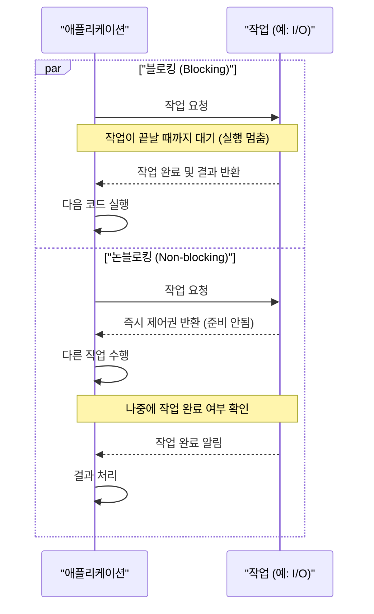
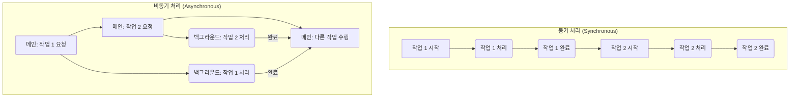

## 개요

Python으로 개발하다 보면 '동시성(Concurrency)'이라는 개념을 꼭 마주하게 됩니다. 특히 **블로킹(Blocking), 논블로킹(Non-blocking), 동기(Synchronous), 비동기(Asynchronous)** 같은 용어들은 처음에는 비슷해 보여서 혼란스러울 때가 많습니다.

하지만 고성능 애플리케이션을 만들기 위해서는 이 개념들을 제대로 이해하고 상황에 맞게 사용하는 것이 정말 중요합니다. 이 글에서는 각 개념이 무엇을 의미하는지, Python에서는 이들이 어떻게 동작하는지, 그리고 GIL(전역 인터프리터 락)이 동시성 모델에 어떤 영향을 미치는지 쉽게 풀어보려고 합니다.

## 1. 작업의 대기 방식: 블로킹(Blocking) vs. 논블로킹(Non-blocking)

모든 작업은 완료하는 데 시간이 걸립니다. 이때 현재 실행 중인 코드가 해당 작업의 완료를 기다리는 방식에 따라 블로킹(Blocking)과 논블로킹(Non-blocking)으로 나뉩니다.

### 블로킹 (Blocking)

블로킹 작업은 이름 그대로, 특정 작업(예: 파일 읽기, 네트워크 요청)이 완료될 때까지 코드의 실행을 **막는(block)** 방식입니다.

예를 들어, requests.get() 함수로 웹 페이지를 요청하면, 응답이 올 때까지 뒤에 있는 코드는 실행되지 않고 멈춰있습니다. time.sleep()이나 input() 함수도 마찬가지로, 각각 지정된 시간이나 사용자 입력이 있을 때까지 스레드를 블로킹합니다.

이런 블로킹 동작은 코드를 이해하기 쉽게 만들지만, 한 작업이 오래 걸리면 애플리케이션 전체가 멈추는 것처럼 보일 수 있습니다. 예를 들어 GUI 애플리케이션에서 블로킹 작업이 실행되면 UI가 응답하지 않는 "벽돌" 상태가 될 수 있죠.

-   **예시:**
    -   파일 I/O: open().read()
    -   네트워크 I/O: socket.accept(), socket.recv(), requests.get()
    -   시간 지연: time.sleep()

### 논블로킹 (Non-blocking)

반면 논블로킹 작업은 특정 작업의 완료를 기다리지 않고, 즉시 다음 코드를 진행하는 방식입니다. 작업을 요청한 뒤, "아직 준비 안 됐어요!" 라는 응답을 받더라도 멈추지 않고 다른 일을 계속 할 수 있습니다.

Python에서 논블로킹 I/O는 주로 운영 체제(OS)의 이벤트 알림 시스템(Linux의 epoll, macOS의 kqueue 등)을 통해 구현됩니다. OS가 백그라운드에서 I/O 작업을 처리하고, 완료되면 애플리케이션에 알려주는 방식이죠. 덕분에 I/O 작업으로 대기하는 시간 동안 다른 유용한 작업을 처리하여 자원을 효율적으로 사용할 수 있습니다.

socket 객체에 setblocking(False)를 호출해 논블로킹 모드로 만들 수 있지만, 단순히 이렇게만 하면 "데이터 준비됐어?"라고 계속 물어보는 폴링(polling) 방식이 되어 CPU를 100% 소모하는 비효율이 발생할 수 있습니다. 그래서 selectors 모듈과 같은 이벤트 알림 시스템을 함께 사용하는 것이 중요합니다.

-   **예시:**
    -   aiohttp를 사용한 웹 요청
    -   asyncpg를 사용한 데이터베이스 쿼리

## 2. 코드 실행 흐름: 동기(Synchronous) vs. 비동기(Asynchronous)

블로킹/논블로킹이 **개별 작업의 대기 방식**에 초점을 맞춘다면, 동기/비동기는 **코드 실행의 전체적인 흐름**과 애플리케이션의 응답성을 다루는 개념입니다.

### 동기 (Synchronous)

동기 애플리케이션에서는 코드가 정해진 순서대로, 하나씩 실행됩니다. 한 줄의 코드가 완전히 끝나야 다음 줄로 넘어갈 수 있죠. 마치 커피숍 바리스타가 한 손님의 주문을 받고, 커피를 만들고, 전달까지 모두 끝낸 후에야 다음 손님 주문을 받는 것과 같습니다. 만약 오래 걸리는 작업이 중간에 끼어 있다면, 그 작업이 끝날 때까지 애플리케이션 전체가 기다려야 합니다.

### 비동기 (Asynchronous)

비동기 프로그래밍은 오래 걸릴 수 있는 작업을 메인 흐름과 독립적으로 실행시키는 방식입니다. 커피숍 바리스타가 주문을 받자마자 커피 머신에게 일을 시켜놓고, 그동안 다른 손님의 주문을 받거나 컵을 정리하는 것과 비슷합니다. 커피가 다 만들어지면 알림을 받고 손님에게 전달만 하면 되죠.

이처럼 비동기 방식은 작업이 완료되기를 기다리는 동안 다른 코드를 실행할 수 있어, 응답성을 유지하면서 여러 I/O 작업을 동시에 처리하는 동시성(Concurrency)을 달성할 수 있습니다.

### Python의 비동기: asyncio

Python에서는 asyncio 라이브러리가 비동기 프로그래밍의 핵심입니다. asyncio는 **싱글 스레드 이벤트 루프(Single-threaded Event Loop)** 모델을 사용하여 단일 스레드 내에서 동시성을 구현합니다.

-   **코루틴(Coroutines)**: async def로 정의하는 특별한 함수입니다. await 키워드를 만나면 실행을 잠시 멈추고 제어권을 이벤트 루프에 넘길 수 있습니다.
-   **await**: 코루틴의 실행을 일시 중지하고, await 대상 작업이 완료될 때까지 이벤트 루프가 다른 작업을 실행하도록 허용합니다.
-   **태스크(Tasks)**: asyncio.create_task()로 코루틴을 감싸서 이벤트 루프에서 즉시 실행되도록 예약하는 객체입니다.
-   **이벤트 루프(Event Loop)**: 태스크들을 관리하며, 어떤 태스크를 언제 실행할지 결정하는 asyncio의 심장입니다. I/O 작업 등으로 대기하는 태스크가 생기면, 다른 실행 가능한 태스크로 전환하여 쉬는 시간 없이 일하도록 만듭니다.

## 3. Python의 특이성: 전역 인터프리터 락(GIL)의 역할

논블로킹 I/O를 사용하는 것이 비동기 프로그래밍의 핵심이며, 이를 통해 동시성을 달성합니다. 하지만 Python의 CPython 구현체에는 GIL(Global Interpreter Lock)이라는 아주 중요한 특징이 있습니다.

### GIL (Global Interpreter Lock) 이란?

GIL은 **한 번에 오직 하나의 스레드만 Python 바이트코드를 실행**할 수 있도록 하는 잠금(lock) 장치입니다. 즉, 최신 멀티코어 CPU를 사용하더라도, 순수 Python 코드는 여러 스레드에서 동시에 실행될 수 없어 진정한 의미의 **병렬(parallel) 처리**가 불가능합니다.

-   **동시성(Concurrency)**: 여러 작업을 번갈아 가며 실행하여 동시에 진행되는 것처럼 보이게 하는 것 (싱글 코어에서도 가능).
-   **병렬성(Parallelism)**: 여러 작업을 실제로 동시에 실행하는 것 (멀티 코어가 필수).

### GIL과 동시성 모델의 관계

GIL 때문에 Python의 동시성 전략은 작업의 종류에 따라 달라집니다.

-   **CPU-Bound 작업 (계산 집약적 작업)**
    -   복잡한 수학 연산, 데이터 처리처럼 CPU를 많이 사용하는 작업은 GIL의 영향을 직접적으로 받습니다.
    -   이런 작업은 multithreading으로 성능 향상을 기대하기 어렵습니다. 스레들이 GIL을 차지하기 위해 경쟁하느라 오히려 더 느려질 수 있습니다.
    -   따라서 CPU-Bound 작업에는 multiprocessing 모듈을 사용해 여러 프로세스를 생성하는 것이 효과적입니다. 각 프로세스는 독립적인 메모리와 GIL을 가지므로, 멀티 코어를 활용한 진정한 병렬 처리가 가능합니다.
    -   (예외: numpy처럼 C로 구현된 일부 라이브러리는 내부적으로 GIL을 해제하므로, 멀티스레딩으로도 성능 향상을 볼 수 있습니다.)

-   **I/O-Bound 작업 (입출력 대기 작업)**
    -   네트워크 요청이나 디스크 접근 같은 I/O 작업은 대부분의 시간을 데이터가 오기를 기다리는 데 사용합니다.
    -   다행히 Python은 이런 I/O 대기 상태에 들어가면 GIL을 해제합니다.
    -   **asyncio**: 이 특징을 가장 잘 활용하는 모델입니다. 한 코루틴이 I/O 대기 상태에 들어가 GIL을 놓으면, 이벤트 루프가 즉시 다른 코루틴을 실행시켜 스레드를 쉬지 않고 효율적으로 사용합니다. 단일 스레드임에도 높은 동시성을 달성할 수 있는 비결이죠.
    -   **multithreading**: 여러 스레드를 사용하는 경우에도, 각 스레드가 I/O 대기 중에 GIL을 놓아주므로 다른 스레드가 실행될 수 있습니다. 따라서 requests와 같은 블로킹 I/O 라이브러리도 멀티스레딩 환경에서는 성능 향상을 볼 수 있습니다. asyncio에서는 ThreadPoolExecutor나 asyncio.to_thread()를 통해 블로킹 라이브러리를 비동기 코드와 함께 사용할 수 있습니다.

## 결론

Python에서 블로킹, 논블로킹, 동기, 비동기 개념은 애플리케이션의 성능과 응답성을 결정하는 핵심 요소입니다. 각 개념의 차이점과 GIL의 역할을 이해하는 것은 매우 중요합니다.

-   **I/O-Bound 작업이 대부분이라면?** asyncio가 최고의 선택입니다. 단일 스레드만으로도 매우 높은 동시성을 효율적으로 처리할 수 있습니다.
-   **CPU-Bound 작업이 문제라면?** multiprocessing을 사용하여 여러 CPU 코어를 적극적으로 활용하고 진정한 병렬성을 확보해야 합니다.
-   **기존 블로킹 라이브러리를 비동기 코드와 함께 써야 한다면?** ThreadPoolExecutor나 asyncio.to_thread()가 훌륭한 해결책이 될 수 있습니다.

결국 "실버 불릿은 없다"는 격언처럼, 내가 만드는 애플리케이션의 작업 부하가 어디에 속하는지(I/O-Bound vs. CPU-Bound)를 정확히 파악하고, 그에 맞는 동시성 모델을 선택하는 것이 가장 중요합니다. 이 글이 여러분의 Python 애플리케이션을 한 단계 더 성장시키는 데 도움이 되었으면 합니다.
