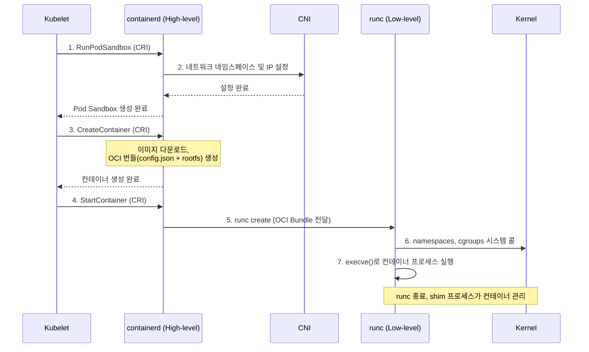

## 개요

쿠버네티스 환경에서 Pod를 관리하다 보면 누구나 한 번쯤은 이런 에러 메시지를 만나게 됩니다.

> OCI runtime exec failed: exec failed: unable to start container process...

이 메시지는 "OCI 런타임이 컨테이너 프로세스를 시작하지 못했다"는 뜻입니다. 대충 컨테이너 실행 단계의 문제라는 것은 알지만, 이 한 줄의 에러 뒤에는 컨테이너 기술의 핵심 표준과 복잡한 상호작용이 숨어있습니다. 

## Container Runtime

리눅스 커널의 기능을 분리하여 운영체제를 따로 설치하지 않고, 컨테이너 이미지를 격리된 공간에서 실행시킬 수 있도록 하는 도구입니다.

cgroup, namespace 등의 리눅스 격리 기술 기반으로 개발되었고, 현재는 CRI-O, containerd 등 다양한 런타임이 개발되었습니다.

## 도커와 LXC(Linux continaer)

2013년 도커가 등장하면서, IT 업계에서 컨테이너 기술의 유행을 이끌었습니다.

당시 LXC를 사용하여 컨테이너 격리 하므로써 cgroup, namespace 등을 쉽게 구현할 수 있도록 개발되었습니다.

당시 **dockerd** 라는 단일 데몬이 이미지 빌드, 관리, PUSH/PULL, 컨테이너 실행, 네트워킹, 스토리지까지 모든 것을 처리하는 모놀로식 엔진으로 구현되어 문제가 됐습니다.

다양한 벤더에서에서 Containter Runtime을 개발하고 있었고, 도커에서도 모놀로식 구조에서 하나씩 기능을 분리하여 현재는 libcontainer 기반으로 컨테이너 런타임을 개발했다고 합니다.

이에 따라 Container runtime 개발에 대한 표준이 필요했고, 그래서 등장한 것이 OCI(Open Container Initiative) 입니다.

## OCI의 등장

OCI는 도커와 다양한 벤더사 사이에서 Container 개발을 위한 표준을 만들면서 등장했습니다.

Container 기술이 대중화되면서 각 벤더사에서 모여 Container 표준을 만들기 시작했고, runc, image-spec 등 도커-컨테이너 이미지가 가져야 하는 표준 가이드라인을 만들었습니다.

| 구성 요소       | 특징                                                               |
| --------------- | ------------------------------------------------------------------ |
| **image-spec**  | 컨테이너 이미지 디스크 포맷                                        |
| **runtime-spec**| 컨테이너의 설정 방법, 실행 환경, 라이프사이클을 명시               |
| **runc**        | OCI 표준에 따라 컨테이너를 생성하고 실행할 수 있는 명령형 도구     |
| **go-digest**   | 컨테이너 생태계에서 광범위하게 활용될 수 있는 공통 다이제스트 패키지 |
| **selinux**     | 컨테이너에 범용적으로 적용될 있는 SELinux 설정                     |

## 쿠버네티스와 CRI(Container Runtime Interface) 의 등장

OCI가 컨테이너 자체의 표준이라면, CRI는 **쿠버네티스가 컨테이너 런타임과 소통하는 방법에 대한 표준 API**입니다. Dockershim과 같은 특정 런타임용 인터페이스를 없애고, 모든 런타임이 공통으로 사용할 수 있는 인터페이스를 만들었습니다.

CRI는 구글의 **gRPC** 프로토콜 기반으로 정의되어 있으며, Kubelet(클라이언트)과 컨테이너 런타임(서버) 간의 통신을 담당합니다. 이 API를 구현하여 이미지 관리, 스토리지, 네트워킹 설정 및 Low-level Runtime 호출까지 컨테이너 생명주기 전반을 관리하는 런타임을 **High-level Runtime**이라고 부릅니다.

-   **containerd**: 도커에서 분리되어 CNCF에 기증된 프로젝트로, 현재 사실상의 표준 High-level Runtime입니다.
-   **CRI-O**: 쿠버네티스만을 위해 만들어진 경량 런타임으로, CRI 명세 이외의 기능은 최소화되어 있습니다.

## Low-level Runtime과 High-level Runtime이란?

컨테이너 런타임은 역할에 따라 두 가지 레벨로 나뉩니다. 이 둘의 관계를 이해하는 것이 전체 구조를 파악하는 핵심입니다.

-   **Low-level Runtime (저수준 런타임)**
    -   **역할**: OCI 런타임 명세(runtime-spec)를 받아 컨테이너를 **실제로 실행하는** 역할만 수행하는 '현장 작업자'입니다. 리눅스 커널의 namespaces와 cgroups 같은 기능을 직접 호출하여 격리된 실행 환경을 만듭니다.
    -   **입력**: OCI 번들 (파일 시스템 + config.json)
    -   **대표 주자**: runc, crun

-   **High-level Runtime (고수준 런타임)**
    -   **역할**: 이미지 다운로드 및 관리, 스토리지 설정, 네트워크 설정(CNI 연동) 등 컨테이너 실행에 필요한 **전반적인 준비와 관리**를 담당하는 '총괄 매니저'입니다. CRI 요청을 받아 내부 로직을 처리한 뒤, 마지막에 Low-level Runtime을 호출하여 컨테이너 실행을 위임합니다.
    -   **입력**: 쿠버네티스 Kubelet의 CRI 요청 (gRPC)
    -   **대표 주자**: containerd, CRI-O

## 전체 동작 흐름: kubectl 부터 컨테이너 실행까지

이제 Kubelet이 High-level/Low-level 런타임을 통해 컨테이너를 실행하는 전체 과정을 단계별로 살펴보겠습니다.

1.  **Pod 샌드박스 생성 (RunPodSandbox)**: Kubelet은 CRI를 통해 containerd에게 Pod를 위한 격리 환경(네트워크 네임스페이스 등) 생성을 요청합니다.
2.  **네트워크 설정**: containerd는 CNI 플러그인을 호출하여 Pod의 네트워크를 설정합니다.
3.  **컨테이너 생성 (CreateContainer)**: Kubelet이 컨테이너 생성을 요청하면, containerd는 필요한 이미지를 다운로드하고 OCI 번들(Root 파일시스템과 config.json)을 준비합니다.
4.  **컨테이너 시작 (StartContainer)**: Kubelet이 컨테이너 시작을 요청합니다.
5.  **runc 호출**: containerd는 Low-level 런타임인 runc를 호출하며 OCI 번들을 전달합니다.
6.  **격리 환경 구성**: runc는 config.json 명세에 따라 리눅스 커널에 시스템 콜을 보내 namespaces와 cgroups를 설정합니다.
7.  **프로세스 실행**: runc는 격리된 환경에서 execve 시스템 콜을 통해 컨테이너의 첫 프로세스를 실행시킨 후 자신은 종료됩니다. 이후 컨테이너 프로세스는 containerd-shim이라는 프로세스를 통해 관리됩니다.

## 결론

초기 컨테이너 기술은 도커라는 단일 엔진에 모든 기능이 통합된 모놀리식 구조였습니다. 하지만 생태계가 확장되면서 유연성과 확장성을 위해 각 기능이 분리되고 표준화되는 과정을 거쳤습니다.

그 결과, 현재의 쿠버네티스 컨테이너 아키텍처는 명확한 계층 구조를 갖게 되었습니다.

-   **CRI**: 쿠버네티스와 런타임의 소통을 표준화하는 **상위 레벨 인터페이스**
-   **High-level Runtime**: 이미지, 네트워크 등 컨테이너의 생명주기를 **총괄 관리**
-   **OCI**: 컨테이너의 실행 방식을 정의하는 **하위 레벨 명세**
-   **Low-level Runtime**: OCI 명세에 따라 컨테이너 프로세스를 **직접 실행**

이렇게 역할이 분리되면서 우리는 필요에 따라 containerd 대신 CRI-O를 사용하거나, runc 대신 crun을 사용하는 등 각 계층의 구현체를 유연하게 교체할 수 있게 되었습니다.

이제 "OCI runtime exec failed"와 같은 에러를 다시 마주쳤을 때, 우리는 이 복잡한 과정 중 'Low-level 런타임이 OCI 명세에 따라 프로세스를 실행하는 마지막 단계'에서 문제가 발생했음을 정확히 짚어낼 수 있습니다.

## 참조
https://kubernetes.io/blog/2016/12/container-runtime-interface-cri-in-kubernetes/

