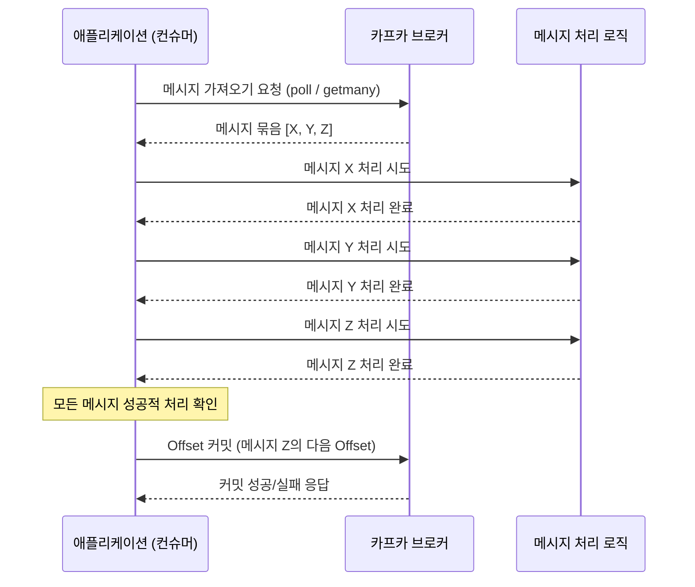

## 개요 

카프카 클라이언트 개발 시 만나는 고민거리 중 하나는 카프카 Offset 커밋 전략을 어떻게 가져가느냐입니다.

이 글에서는 Kafka의 Offset 커밋 방식, 특히 자동 커밋과 수동 커밋의 차이점, 그리고 각 방식의 주의사항에 대해 자세히 알아보겠습니다.

## 1. Offset이란 무엇이고 어떻게 동작하는가?

카프카에서 **Offset**은 각 **파티션(Partition)** 내 메시지의 위치를 나타내는 숫자입니다. 각 메시지는 파티션 내에서 고유한 Offset 값을 가지며, 이 값은 순차적으로 증가합니다. 컨슈머는 이 Offset을 기준으로 특정 파티션의 메시지를 어디까지 읽었는지 기억합니다.

**컨슈머 그룹(Consumer Group)** 내의 컨슈머들은 동일한 토픽의 서로 다른 파티션에서 메시지를 가져와 처리합니다. 이때, 각 컨슈머는 자신이 담당하는 파티션의 Offset을 카프카 브로커 또는 외부 저장소(과거에는 ZooKeeper)에 주기적으로 저장하는데, 이 과정을 **커밋(Commit)**이라고 합니다.

커밋된 Offset은 다음과 같은 중요한 역할을 합니다.

*   **소비 위치 기록**: 컨슈머가 특정 파티션의 메시지를 어디까지 성공적으로 처리했는지 정확히 기억합니다.
*   **장애 복구**: 컨슈머에 장애가 발생하여 재시작되거나, 새로운 컨슈머가 그룹에 참여하여 리밸런싱이 발생할 때, 커밋된 Offset부터 메시지를 다시 읽어와 중복 처리나 유실 없이 작업을 이어갈 수 있도록 합니다.

## 2. 자동 커밋(Auto Commit)의 편리함과 위험성

카프카 컨슈머는 기본적으로 Offset을 자동으로 커밋하도록 설정되어 있는 경우가 많습니다.
(**enable.auto.commit=true**가 기본값이며, **auto.commit.interval.ms** 설정된 간격마다 주기적으로 커밋합니다.)
이는 Offset 관리에 크게 신경 쓰지 않아도 되어 편리하지만, 특정 상황에서는 **메시지 유실**이나 **메시지 중복 처리**의 원인이 될 수 있습니다.

### 자동 커밋 시 발생할 수 있는 문제점

*   **메시지 유실 (Data Loss)**: 컨슈머가 메시지를 가져와서(poll) 애플리케이션 로직을 처리하는 도중에, 아직 처리가 완료되지 않았음에도 불구하고 **auto.commit.interval.ms** 시간이 경과하여 자동 커밋이 먼저 실행될 수 있습니다. 만약 이때 컨슈머에 장애가 발생하면, 해당 메시지는 처리된 것으로 간주되어 결국 유실될 수 있습니다.

    ```mermaid
    sequenceDiagram
        participant ConsumerApp as 컨슈머 애플리케이션
        participant KafkaBroker as 카프카 브로커
        participant MessageLogic as 메시지 처리 로직

        ConsumerApp->>KafkaBroker: 메시지 가져오기 요청 (poll)
        KafkaBroker-->>ConsumerApp: 메시지 [A, B, C] (Offset: 10, 11, 12)
        Note over ConsumerApp,KafkaBroker: 다음 자동 커밋될 Offset은 13
        ConsumerApp->>MessageLogic: 메시지 A 처리 시작
        Note right of ConsumerApp: auto.commit.interval.ms 경과!
        ConsumerApp->>KafkaBroker: Offset 13 커밋 (자동)
        MessageLogic-->>ConsumerApp: 메시지 A 처리 중 치명적 오류 발생!
        Note over ConsumerApp: 컨슈머 비정상 종료 또는 재시작
        ConsumerApp->>KafkaBroker: 커밋된 Offset 13부터 다시 읽기 시도
        Note left of KafkaBroker: 메시지 A, B, C는 이미 처리된 것으로 간주
        Note over ConsumerApp, MessageLogic: 메시지 A, B, C 유실 발생!
    ```

*   **메시지 중복 처리 (Duplicate Processing)**: 메시지를 가져와 모든 처리를 성공적으로 완료했지만, 변경된 Offset 정보가 카프카 브로커에 자동으로 커밋되기 전에 컨슈머가 비정상적으로 종료되거나 리밸런싱이 발생하면, 마지막으로 커밋된 이전 Offset부터 다시 메시지를 읽어와 이미 처리한 메시지를 중복으로 처리할 수 있습니다.

자동 커밋은 개발 초기 단계나 메시지 처리에 실패해도 큰 영향이 없는 경우에 편리하게 사용할 수 있습니다.
하지만 대부분의 프로덕션 환경에서는 메시지 처리의 정확성과 신뢰성을 보장하기 위해 **수동 커밋 방식이 강력히 권장됩니다.**

## 3. 수동 커밋(Manual Commit)으로 신뢰성 높이기

수동 커밋은 개발자가 코드 내에서 명시적으로 Offset을 커밋하는 방식입니다. 이를 통해 메시지 처리의 완료 시점을 정확하게 제어할 수 있어, 위에서 언급된 자동 커밋의 문제점들을 효과적으로 해결할 수 있습니다. 수동 커밋을 사용하려면 컨슈머 설정에서 **enable_auto_commit=false**로 지정해야 합니다.

수동 커밋에는 크게 **동기(Synchronous) 방식**과 **비동기(Asynchronous) 방식**이 있습니다.

### 3.1. 동기 커밋 (Synchronous Commit)

*   Python에서는 await consumer.commit()을 호출하여 사용합니다. 특정 오프셋을 지정하려면 await consumer.commit(offsets)를 사용할 수 있습니다.
*   이 메서드는 카프카 브로커로부터 커밋 요청에 대한 응답을 받을 때까지 기다립니다(블로킹). 즉, 커밋이 완료될 때까지 다음 코드로 진행하지 않습니다.
*   **장점**: 커밋이 성공했는지, 실패했는지 확실하게 알 수 있고 예외 처리를 통해 재시도 로직을 구현할 수 있습니다. 구현이 비교적 간단합니다.
*   **단점**: 커밋이 완료될 때까지 대기하므로, 애플리케이션의 전체 처리량(Throughput)이 다소 낮아질 수 있습니다. 특히 커밋 주기가 짧을수록 (예: 매 메시지마다 커밋) 이 영향은 커집니다.

### 3.2. 비동기 커밋 (Asynchronous Commit)

*   Python에서는 aiokafka의 특성상 모든 커밋이 기본적으로 비동기입니다. await consumer.commit()도 실제로는 비동기 방식으로 동작하지만 결과를 기다립니다.
*   순수한 비동기 방식을 원한다면 asyncio.create_task(consumer.commit())를 사용하여 커밋 작업을 백그라운드에서 실행할 수 있습니다.
*   **장점**: 커밋 작업이 백그라운드에서 실행되므로 메시지 처리 처리량이 높아집니다.
*   **단점**:
    *   커밋 실패를 즉시 감지하기 어려우며, 별도의 예외 처리 로직이 복잡해집니다.
    *   비동기 커밋 실패 시 무조건적인 재시도는 주의해야 합니다. 첫 번째 비동기 커밋(예: Offset 100)이 네트워크 지연 등으로 실패하고, 그 사이 다음 메시지들을 처리 후 더 높은 Offset(예: Offset 200)으로 비동기 커밋을 성공시켰다고 가정합시다. 이때 뒤늦게 첫 번째 실패한 Offset 100을 재시도하여 성공하면, 이미 Offset 200까지 처리했음에도 불구하고 컨슈머의 커밋된 Offset이 100으로 되돌아가 메시지 중복 처리의 원인이 될 수 있습니다.
    *   따라서 비동기 커밋 실패 시에는 보통 심각한 오류로 간주하고 로깅만 하거나, 다음 번의 성공적인 커밋에 의존하는 경우가 많습니다.


### 수동 커밋 흐름 (Mermaid 다이어그램)



## 4. 수동 커밋 시 추가 고려사항

수동 커밋을 효과적으로 사용하기 위해서는 몇 가지 추가 사항을 고려해야 합니다.

*   **커밋 빈도 (Commit Frequency)**:
    *   너무 자주 커밋하면 (예: 메시지 1건마다 동기 커밋) 카프카 브로커와의 통신 오버헤드로 인해 성능에 부담을 줄 수 있습니다.
    *   반대로 너무 드물게 커밋하면 (예: 수천 건 처리 후 또는 몇 분 간격으로 커밋) 장애 발생 시 재처리해야 하는 메시지의 양이 많아져 복구 시간이 길어지고 중복 처리 가능성도 커집니다.
    *   애플리케이션의 특성, 메시지 처리 시간, 허용 가능한 중복/유실 수준 등을 고려하여 적절한 커밋 빈도(또는 배치 크기)를 설정하는 것이 중요합니다. (일괄 커밋 방식 적극 고려)

*   **재조정 (Rebalancing) 처리**:
    *   컨슈머 그룹에 새로운 컨슈머가 추가되거나 기존 컨슈머가 이탈할 때, 또는 구독한 토픽의 파티션 수가 변경될 때 **재조정**이 발생합니다.
    *   수동 커밋 사용 시, 재조정이 발생하기 직전에 마지막으로 성공적으로 처리한 Offset을 정확히 커밋해야 중복이나 유실을 방지할 수 있습니다.

*   **정확한 Offset 커밋**:
    *   항상 마지막으로 *성공적으로 처리된* 메시지의 **다음 Offset** (처리된_Offset + 1)을 커밋해야 합니다.
    *   메시지 묶음(배치)을 처리할 경우, 묶음 내의 모든 메시지가 성공적으로 처리되었을 때 해당 묶음의 가장 마지막 메시지의 Offset을 기준으로 커밋합니다. 만약 배치 처리 중 일부 메시지만 성공하고 일부는 실패했다면, 성공한 부분까지만 커밋하거나, 배치를 롤백하고 재시도하는 등의 복잡한 전략이 필요할 수 있습니다.

*   **오류 처리 및 재시도 로직**:
    *   메시지 처리 중 발생하는 예외(네트워크 오류, DB 오류 등)나 커밋 실패 시 어떻게 대응할지에 대한 명확한 전략이 필요합니다.
    *   일시적인 오류라면 재시도(retry) 로직을 구현할 수 있습니다.
    *   반복적으로 실패하는 메시지는 별도의 처리 로직을 만들거나, 오류를 로깅하고 해당 메시지를 건너뛰는 등의 처리가 필요합니다. 그렇지 않으면 해당 메시지에서 컨슈머가 계속 멈춰있게 됩니다.

## 5. 자동 / 수동 커밋 전략 선택

메시지 처리의 신뢰성이 매우 중요하면 **수동 커밋**을 사용하는 것이 정답에 가깝습니다. 수동 커밋은 개발자가 Offset을 직접 제어함으로써 메시지 유실이나 의도치 않은 중복 처리의 위험을 크게 줄일 수 있습니다.

*   **자동 커밋**: 개발이 매우 간단하고, 약간의 메시지 유실이나 중복이 허용되는 경우 (예: 모니터링 데이터 수집)에만 제한적으로 사용합니다.
*   **수동 동기 커밋**: 구현이 비교적 간단하고 커밋 성공 여부를 확실히 알 수 있어 안정적입니다. 하지만 처리량이 낮아질 수 있습니다. 장애 발생 시 마지막 처리 상태를 정확히 복원해야 할 때, 또는 커밋 빈도가 높지 않을 때 유용합니다.
*   **수동 비동기 커밋**: 처리량을 극대화할 수 있지만, 커밋 실패 시 관리가 복잡할 수 있습니다. 실패에 대한 콜백 처리 및 재시도 전략이 중요합니다.


