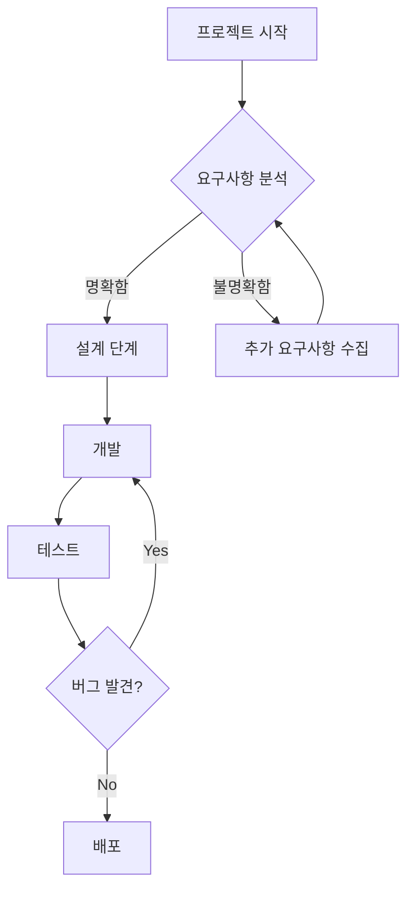
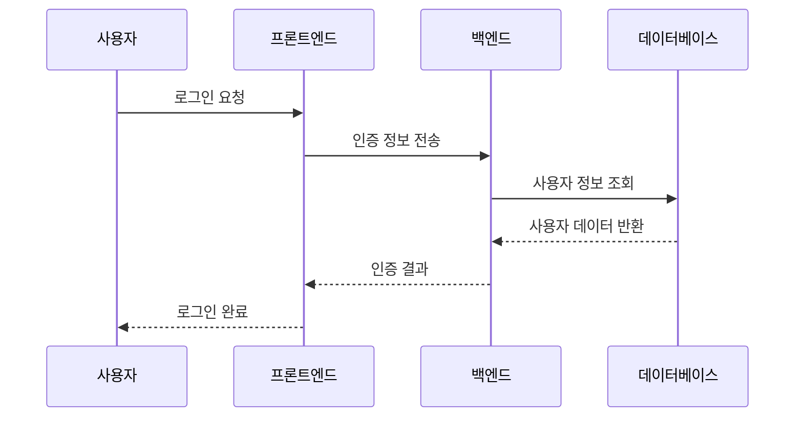

## Mermaid 다이어그램 활용법

이 블로그에서는 Mermaid를 사용하여 다양한 다이어그램을 작성할 수 있습니다.

### 플로우차트 예시

업무 프로세스나 의사결정 과정을 시각화할 때 유용합니다:

### 시퀀스 다이어그램 예시

시스템 간의 상호작용을 표현할 때 활용할 수 있습니다:

### 기타 지원하는 다이어그램

- 클래스 다이어그램 (classDiagram)
- 상태 다이어그램 (stateDiagram)
- 간트 차트 (gantt)
- 파이 차트 (pie)
- ER 다이어그램 (erDiagram)

이제 블로그에서 자유롭게 다이어그램을 활용해보세요! 