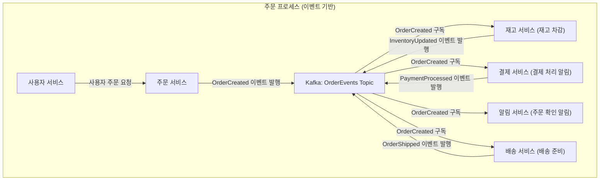
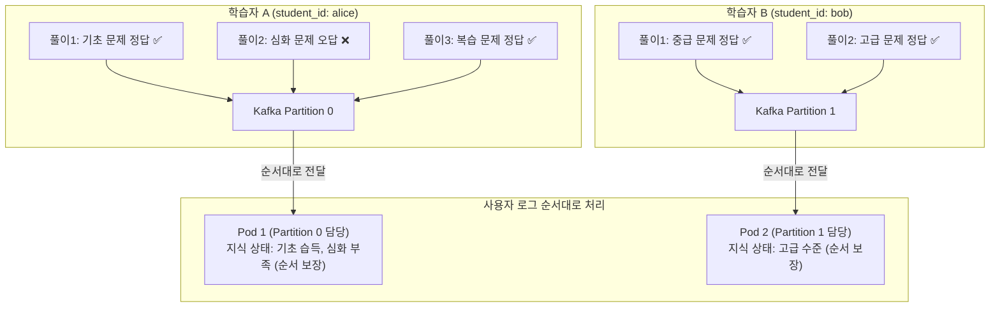

## 개요

최근 데이터 프로세싱과 빅데이터 분야의 프로젝트들이 많이 생기면서 카프카 클러스터를 사용하는 아키텍처들을 쉽게 볼 수 있습니다. 더불어 많은 포지션에서도 카프카 사용 경험에 대해서 우대사항으로 두고 있죠.

하지만 카프카를 왜 사용하는지에 대해서 누군가를 설득하기까지엔 장황한 설명이 필요하게 됩니다.

현재 진행하고 있는 프로젝트에서 핵심 리소스 중 하나인 카프카를 사용하면서 느낀 점을 바탕으로 어떤 상황에서 가장 효과적이였는지, 그리고 카프카를 통해 해결할 수 있는 문제가 무엇이 있었는지 공유하고자 합니다.

## 1. GPT에게 물어보는 카프카 사용 이유

먼저 GPT에게 카프카 클러스터를 왜 사용하는지, 그리고 짧게 답변해달라고 물어봤는데, 아래처럼 답변을 하더군요.

GPT의 답변을 요약하자면, 카프카는 **분산 처리, 높은 처리량(High Throughput), 낮은 지연시간(Low Latency), 데이터 복제(Replication) 및 내결함성(Fault Tolerance)** 같은 기능들을 제공하며,
실시간 데이터 스트리밍, 로그 수집, 사용자 행동 분석 등 다양한 분야에서 사실상 표준으로 이라고 하네요.

## 2. 로그 수집에서는 어떤 강점이 있는건가?

로그 수집 관점에서 카프카를 사용할 때 개인적으로 가장 큰 강점은 **다양한 형태의 데이터를 유연하게 처리할 수 있다**는 점이라고 생각합니다.

예를 들어, 대규모 플랫폼에서 발생하는 수많은 서비스 로그들 중 특정 중요 정보만을 추출하여 어딘가로 보내 처리하고 싶다고 가정 했을때,
이때 각 서비스가 생성하는 로그의 스키마가 제각각일 수도 있고, 데이터의 성격에 따라 논리적으로 분리하여 관리하고 싶을 수도 있습니다.

이런 상황에서 카프카는 마치 ELT 파이프라인의 데이터 레이크처럼, 다양한 비정형 데이터를 일단 수집하여 원하는 목적지로 전달하는 역할을 수행할 수 있습니다.
애플리케이션들은 단일 카프카 엔드포인트 정보만 알고 있으면, 각자의 필요에 따라 토픽(Topic)만 지정하여 메시지를 손쉽게 전송할 수 있죠.

데이터 스키마가 변경되거나 새로운 로그 포맷이 추가되어도 카프카는 이를 일단 수신하는 것까지는 문제 없습니다.(처리하는 쪽에 일을 떠넘기는 것이긴 합니다.)

## 3. 마이크로서비스 이벤트 버스로 사용한다면,

MSA에서 각 마이크로서비스는 이벤트 기반(Event-Driven)으로 설계되어 특정 이벤트 발생 시 카프카에 메시지를 발행하고, 필요한 이벤트를 구독하여 처리하는 구조가 됩니다.

예를 들어 '주문 생성'이라는 이벤트가 발생하면, 주문 서비스는 이 이벤트를 카프카의 특정 토픽에 발행합니다. 

그러면 이 '주문 생성' 이벤트에 관심 있는 재고 서비스, 배송 서비스, 알림 서비스 등 여러 소비자들이 각자의 로직을 비동기적으로 수행할 수 있습니다.
각 서비스는 다른 서비스의 상태나 가용성에 직접적인 영향을 받지 않게 되죠. 

하나의 서비스가 일시적으로 장애가 발생하더라도 카프카가 이벤트를 안전하게 보관하고 있다가 서비스가 복구되면 전달해주므로 시스템 전체의 안정성도 높아집니다.

이 구조는 클라우드 서비스 제공자들이 지원하는 서버리스 함수와 비슷하게 처리할 수 있습니다. 카프카의 특정 토픽에 이벤트가 들어오면 해당 함수를 트리거하여 실행시키는 방식으로 경량의 이벤트 처리기처럼 구현하는 것이죠.

또한, 이 과정에서 백엔드 서비스 간의 복잡한 환경 변수 설정이나 API 호출 관리가 줄어드는 부수적인 이점도 있습니다. 관리자 입장에서는 각 서비스가 이벤트를 잘 소비하고 있는지 카프카 컨슈머 랙을 모니터링함으로써 서비스의 상태를 파악할 수도 있습니다.

## 4. 또 다른 장점이 있다면?

카프카를 활용하여 얻을 수 있는 또 다른 중요한 장점은 바로 **메시지 처리 순서 보장**과 이를 응용한 **선입선출(FCFS, First-Come, First-Served)과 같은 큐(Queue) 구현**입니다.

예를 들어, Kubernetes 클러스터에서 여러 Pod로 배포된 Knowledge tracing 시스템이 학습자의 문제 풀이 결과를 받아 지식 상태를 실시간으로 추정한다고 가정해보면, 풀이 결과들은 그 순서가 매우 중요합니다.

카프카를 사용하면, 특정 기준(예: 학습자 ID)을 파티션 키(Partition Key)로 지정하여 해당 키를 가진 메시지들이 항상 동일한 파티션으로 전송되도록 할 수 있습니다.
각 파티션 내에서는 메시지가 추가된 순서대로 저장되고 소비되므로, 특정 학습자의 문제 풀이 결과는 발생 순서대로 처리될 수 있는 것이죠.
이렇게 하면 각 파티션이 특정 학습자를 위한 전용 큐처럼 동작하게 되어, 복잡한 순서 보장 로직을 애플리케이션 레벨에서 구현할 필요 없이 카프카의 기능을 활용할 수 있습니다.

물론, 전체 메시지에 대한 글로벌 순서 보장이 필요한 경우라면 카프카만으로는 한계가 있고 추가적인 설계가 필요하지만, 많은 경우 파티션 단위의 순서 보장만으로도 충분히 요구사항을 만족시킬 수 있습니다.

## 카프카 클러스터를 사용하면서 피곤한 점들

일단 카프카가 아키텍처에 포함이 되면 정말 피곤한 부분들이 많이 생깁니다. 우선 로컬 개발 환경에서도 카프카 클러스터를 구축하기도 하고, 일반적인 REST API의 테스트 방법과 동일하지 않습니다.
물론 고도화된 개발 환경을 세팅한다면 그 과정이 보다 수월하겠지만, 그것도 어느정도 리소스를 사용하게 되는 것이지요. 또한 배포시에 전체 로직 테스트를 수행하는 과정도 까다로운 작업이 됩니다.

## 5. 결론

카프카는 분명 강력한 도구입니다. 앞서 살펴본 것처럼 **대용량 로그의 실시간 처리, 마이크로서비스 간의 유연한 이벤트 연동, 그리고 파티션 기반의 순서 보장** 등 다양한 시나리오에서 그 효용성을 발휘합니다.
특히 데이터가 폭증하고 서비스 간의 상호작용이 복잡해지는 현대의 애플리케이션 환경에서 카프카는 시스템의 확장성, 안정성, 그리고 유연성을 한 단계 끌어올릴 수 있는 핵심 요소가 될 수 있습니다.

물론, "카프카 클러스터를 사용하면서 피곤한 점들"에서 언급했듯이 카프카를 도입하고 운영하는 것은 결코 간단한 일이 아닙니다.
러닝커브가 좀 있고, 운영 및 모니터링, 로컬 개발 환경 구축 등 신경 써야 할 부분이 많습니다.
그럼에도 불구하고, 카프카가 제공하는 아키텍처상의 이점과 문제 해결 능력을 고려했을 때, 적절한 상황과 목적을 가지고 도입한다면 그 '피곤함'을 상쇄하고도 남을 만한 가치를 제공한다고 생각합니다.

결국 중요한 것은 '왜 카프카를 사용하는가?'에 대한 명확한 이해와, 우리 시스템이 해결하고자 하는 문제가 카프카의 강점과 잘 부합하는지를 판단하는 것입니다.
단순히 유행을 따르거나, 모든 문제를 카프카로 해결하려는 '만능주의'는 지양해야 합니다. 하지만 카프카의 본질을 이해하고 전략적으로 활용한다면, 분명 복잡한 데이터 문제를 해결하고 더 나은 시스템을 구축하는 데 훌륭한 도움이 될 것 같습니다.

